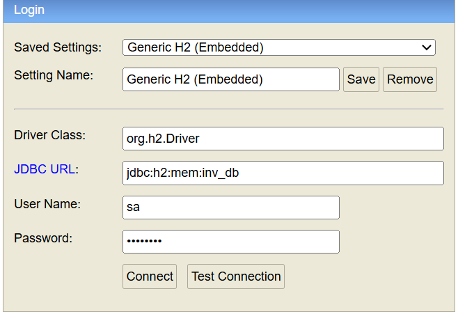

# Inventory Service

Please find the swagger link to know about all API End Points
http://localhost:8081/swagger-ui/index.html

### To access In Memory H2 Console from browser, please use below details

Please use url  in browser http://localhost:8081/h2-console and login as

### In application.yml , please specify the configuration as below 

-------------------------------------------------------------------
spring:
  datasource:
    url: jdbc:h2:mem:inv_db;DB_CLOSE_DELAY=-1;DB_CLOSE_ON_EXIT=FALSE
    username: sa
    password: *****
    driverClassName: org.h2.Driver
  jpa:
    database-platform: org.hibernate.dialect.H2Dialect
    hibernate:
      ddl-auto: create-drop
  h2:
    console:
      enabled: true
      path: /h2-console
JDBC URL : jdbc:h2:mem:inv_db
-----------------------------------------------------------------------

## TO DO (To connect to same in memory db, we need to run h2 server externally as below)

### Go to command prompt and

cd C:\Users\pradeep.a.ramaiah\.m2\repository\com\h2database\h2\2.4.240

### Execute either of the command to run H2 Server

java -cp h2-2.4.240.jar org.h2.tools.Server -tcp -tcpAllowOthers -tcpPort 9092 -web
(or)
java -cp h2-2.4.240.jar org.h2.tools.Server -tcp -tcpAllowOthers -tcpPort 9092 -ifNotExists

### Use the below tcp url in application.yaml file as url

For ex:-
spring.datasource.url: jdbc:h2:tcp://localhost:9092/mem:mydb;DB_CLOSE_DELAY=-1;DB_CLOSE_ON_EXIT=FALSE

### To see h2 console in browser , please use the below link

http://192.168.43.165:8082
 
